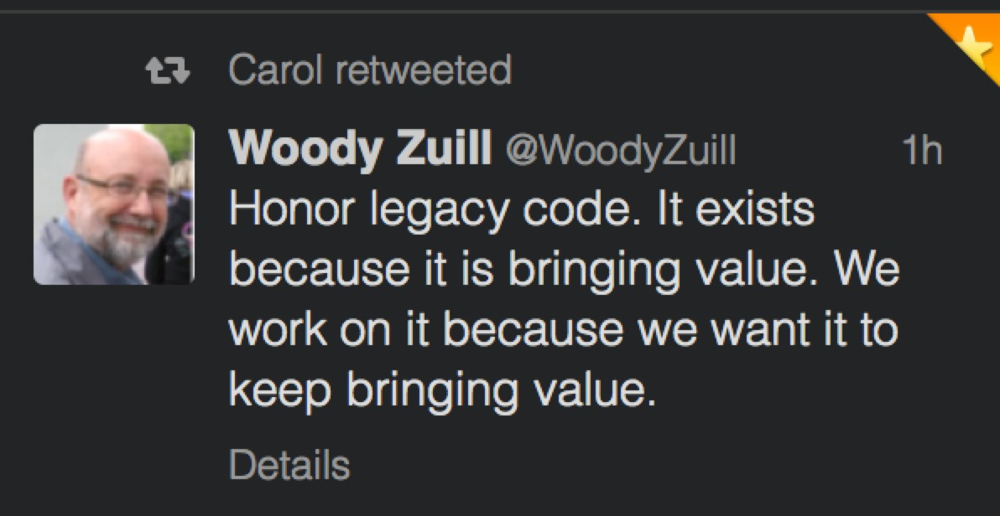
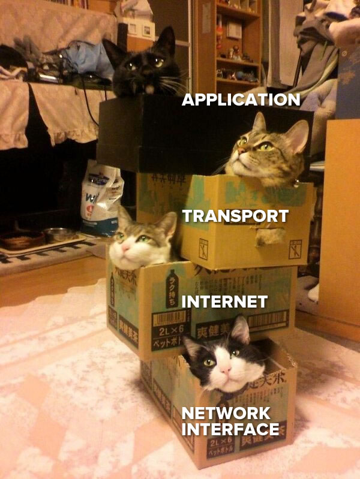

% Surviving Large Unfamiliar Codebases
% Zander Hill
% July 10, 2014

# A Harrowing Tale of Legacy Apps and Oracle Databases

# My Background

## Zander

- Polyglot. Ruby by day, statically typed by night. Remote work evangelist.

- Use vim for coding and Emacs for writing this presentation.

- <3 modal editing and longs walks through documentation.

## Where I Work

- Work at a product company on team with 20 Engineers. Around 80 Engineers when including `Ruby/Js, Clojure, .NET, and Ops` teams.

- We've had our primary website since 1999 (.NET).

- Currently support two primary sites and ~ 10 secondary services.

# Legacy Code

## We've got history :).

- Started in 1999 (date of first website on wayback machine)

- 2 Apps still on `ruby-1.8.7`.

- At least one still on `rails-2.3.x`.

## Proof

## RESPECT

## alt Respect

## Mess

## Layers

## 

## 

## 

# Remainder
## What am I calling Large

- Prelude doesn’t encode uncertainty in the API where it’s possible to do so for partial functions

- `head :: [a] -> a` — is a damn lie, surpassed in damnation only by statistics and politicians

- Should be — `head :: [a] -> Maybe a`

## SLOC and costs of system

- length cannot and should not exist for a type that has the capability to be coinductive. 

- Nuts.

- `length [1..]` -> bottom  — this is gross. We’re betraying new people by leaving stuff like this in Prelude.

## Discuss Ruby vs. Javascript Code (TDD importance on Js side)

- What made head dangerous was the empty list case. There’s another problematic case - codata.

- Coinductive lists are things like: [1..]

- Coinduction guarantees productivity but not termination

# El Fin
## Zander Hill
- E: zander@xargs.io
- G: ZPH
- T: @_ZPH
