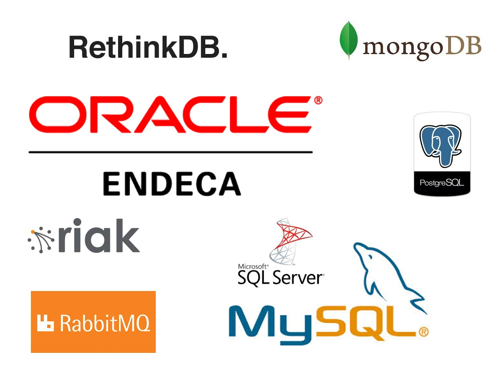
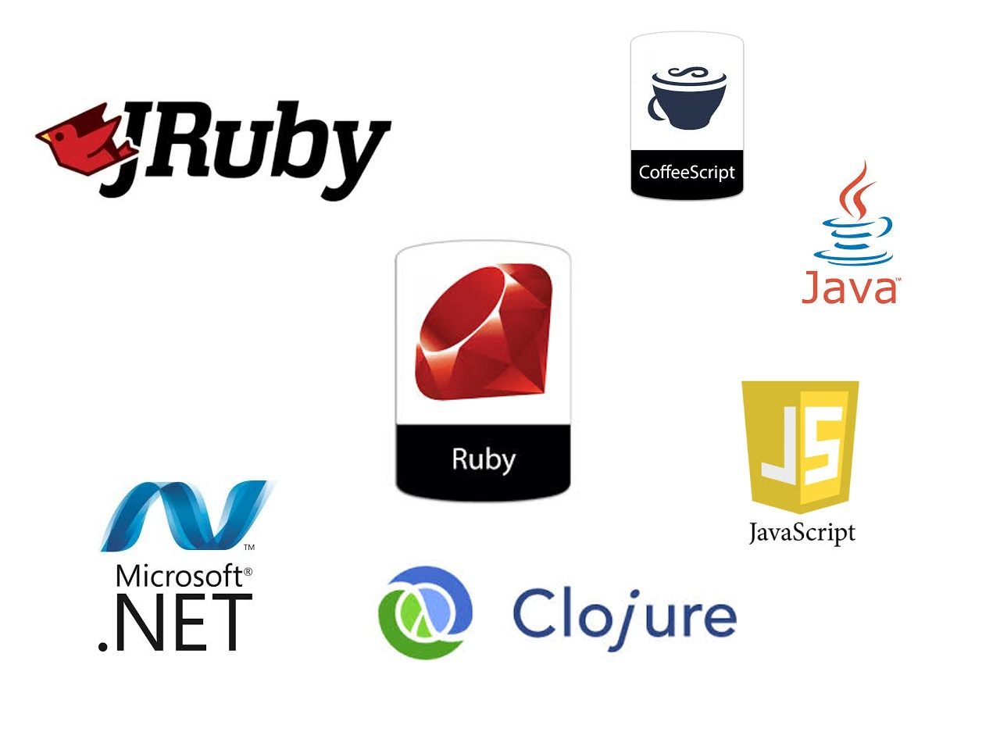
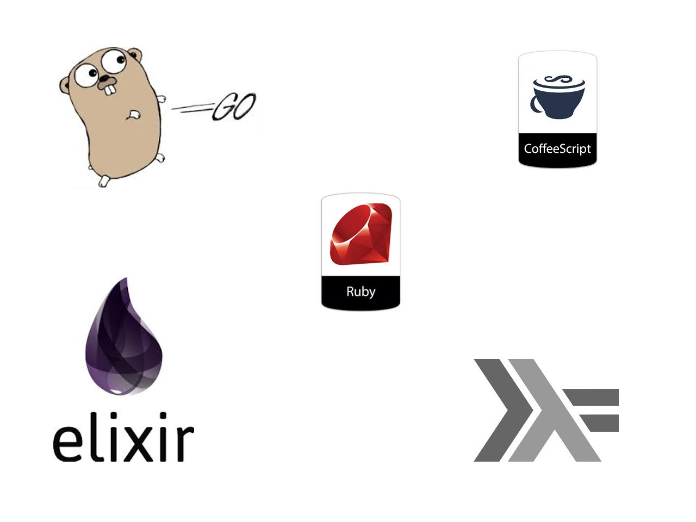
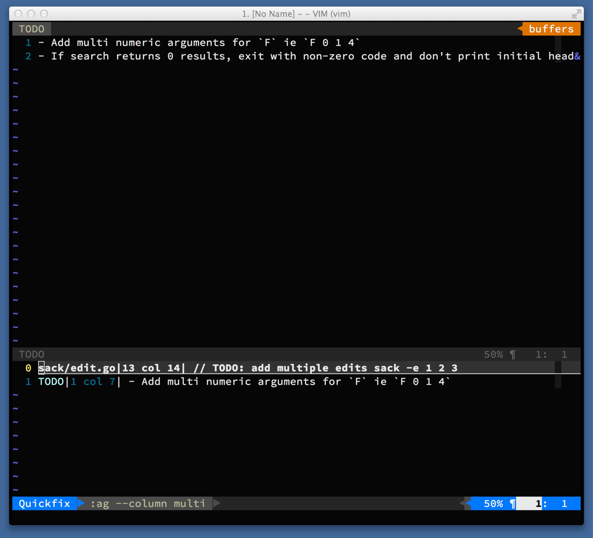
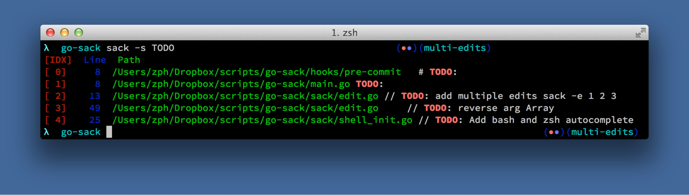
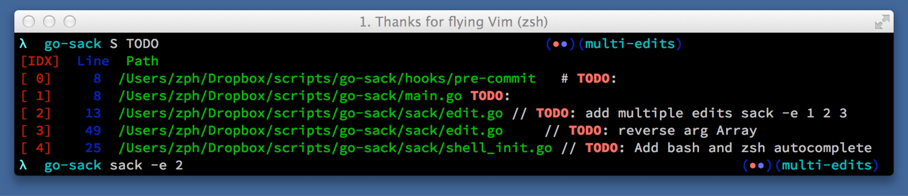
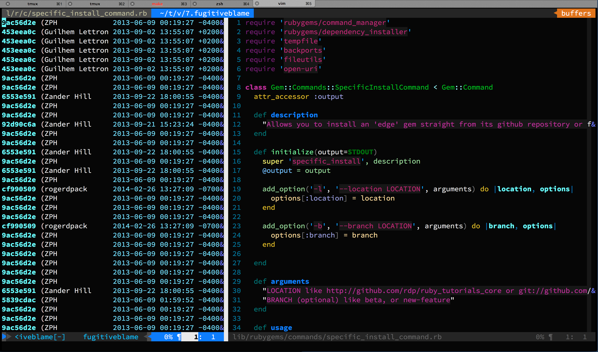
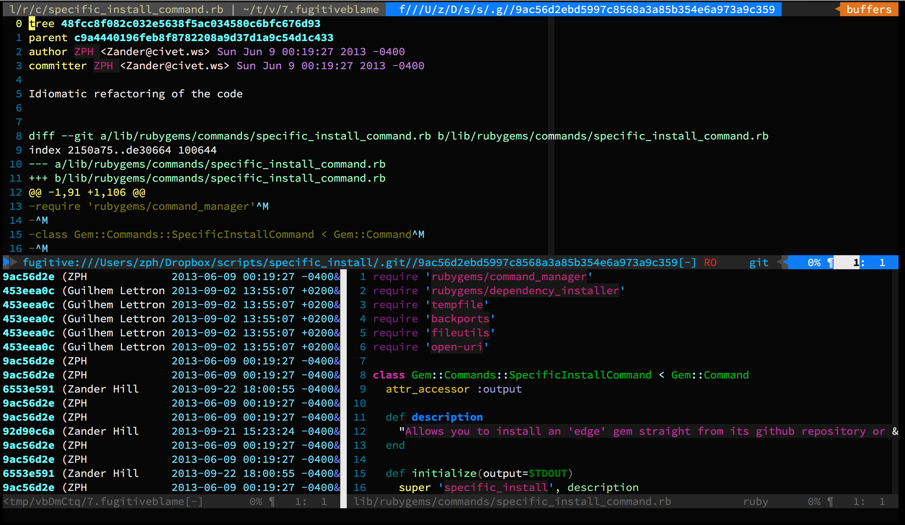

% Surviving Large Unfamiliar Codebases
% Zander Hill
% July 10, 2014

# A Harrowing Tale of Legacy Apps and Oracle Databases

# My Background

## Zander

- Polyglot. Ruby by day, statically typed by night. Remote work evangelist.

- Use vim for coding and Emacs for writing this presentation.

- <3 modal editing and longs walks through documentation.

## Where I Work

- Work at a product company on team with 20 Engineers. Around 80 Engineers when including all software development teams.

- We've had our primary website since 1999 (.NET).

- Currently support two primary sites and ~ 10 secondary services.

## 


## 


## 


<div class="notes">
- Keep Ruby/Coffeescript for ample supply of coders
- Haskell for the mission critical stuff
- Golang for the systems level programming/easy deploy
- Elixir for our distributed systems that are critical
- This is not to knock clojure or other languages from prior slide, but in our organization I haven't seen Clojure used for anything that Ruby/JRuby couldn't be doing.
</div>

##


## We've got history :).

- Started in 1999 (date of first website on wayback machine)

- 2 Apps still on `ruby-1.8.7`.

- At least one still on `rails-2.3.x`.

# Legacy Code

## Starts simple as an application with a few routes

## Authentication

## Extra Features
- Background processing

## Painful Features
- Integrate RPC
- Parse complex and irregular .XLS uploads
- Parse irregular XML feeds

## Add various managers/CEOs

## Changing Business Goals

## Introduce 50 devs
- Varying backgrounds
- Various skill levels
- Various coding patterns

## Agitate for 5+ yrs

## Confusing


##


## How to make things happy?


##


## Respect


# Outline
##
- Searching
- Debugging
- Communication
- Testing

# Searching

## How to search efficiently in codebase

- [the-silver-searcher](https://github.com/ggreer/the_silver_searcher), [pt](https://github.com/monochromegane/the_platinum_searcher), ack, grep
- Fast and recursive (some by default, some with proper flags)

## Know your ack


## Search + Edit
- the-silver-searcher + wrapper tool called [sack](https://github.com/zph/go-sack).


## Search + Edit
- To Edit



# Debugging

##


## Pry.gem
``` ruby

def troublesome_method
    require 'pry';binding.pry
    even_more_troublesome_variable_that_blows_up
end
```

## pry-remote.gem
```ruby

def troublesome_method_where_we_cant_see_answer
    require 'pry';binding.pry_remote
    even_more_troublesome_variable_that_blows_up
end
```

```ruby

$ bundle exec pry-remote
```

# Communication

## Team + VCS == Sum of Knowledge

## Know who's expert with what
- Who has 3+ yrs with company?
- Who knows the multidimensional Oracle DB?
- Who knows why we chose this routing scheme?
- Who knows how to navigate social dynamics/politics

## Humans knowledge is important
- They'll have context that might be lost in commit
- They might have navigated that issue before

## Go out of your way for people

## When the devs can't speak

## Code Archeology
- Who here has a shortcut in their editor for git blame?
- What about a shortcut for opening a Pivotal Story (or other project tracker)?
- Are your commits tagged with story information?

## Code Archeology
- Fugitive.vim by @tpope


## Code Archeology


# Testing
## Testing - In a Perfect World
- Unit (minitest/rspec/jasmine)
- Integration (cucumber)
- Smoke tests
- Human QA team

## Testing - In the Real World
- Some unit (minitest/rspec/jasmine), sparse Integration
- Manual smoke test at the end of a change
- Human QA team

## Coping Strategies
- Use [VCR](https://github.com/myronmarston/vcr) at app boundary for APIs that you don't control


## Coping Strategies
- Mock carefully, stub even more carefully. 
- Keep logic in places that can easily be tested
 - Away from views.

## Stubs


## Coping Strategies
- Wrap tests with scaffold tests before changes
- [Approvals.gem](https://github.com/kytrinyx/approvals)
  - Possibly disposable, consider in your context.

## Still Exploring
- Property based testing/generative testing with [Rantly](https://github.com/hayeah/rantly)
- Ruby [contracts](https://github.com/egonSchiele/contracts.ruby) (a pale version of Haskell function typing)


# Closing Thoughts
## Think about how you write code
## Write Once; Read Many
## Write for the Maintenance


## Write for the least experienced dev on team

## Write for the Tired Dev


# El Fin
## Zander Hill
``` ruby
{
  email: 'zander@xargs.io',
  github: 'ZPH',
  twitter: '@_ZPH',
}
```
